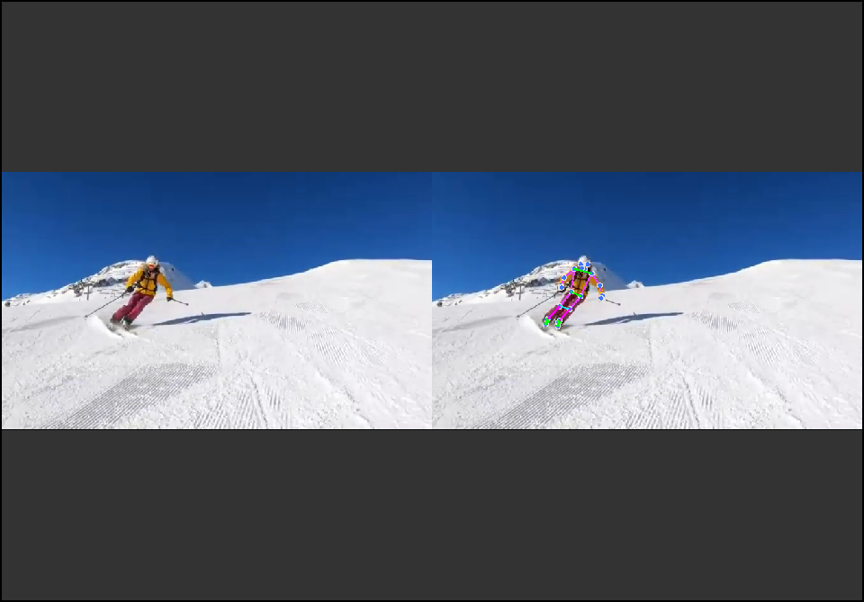

# Real-time-Ski-Pose-Analyzer
Real-time Ski Pose Analyzer 即时滑雪姿态分析器

Usage for Windows
> Env: python 3.12

`pip install mediapipe PyQt5 opencv-python`

`python main.py`

Bug

对于膝关节连线和踝关节连线存在计算误差

Show

